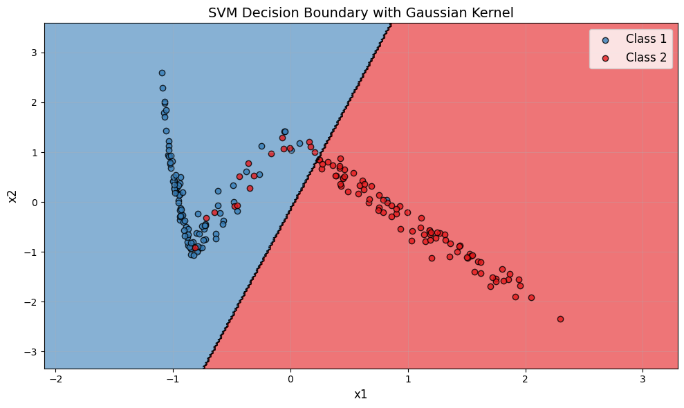
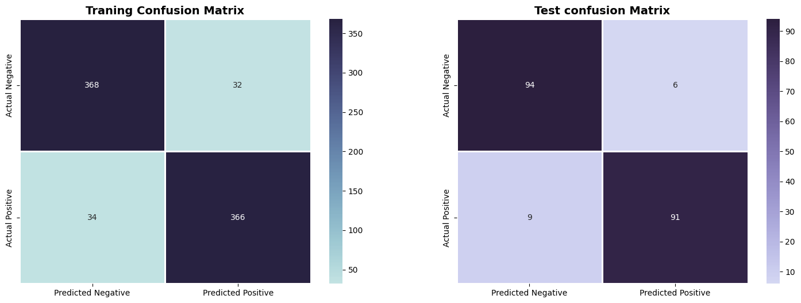

<div align="center">
  <h1>
    Support Vector Machine from Scratch 
  </h1>
  <p><strong>Sapienza University of Rome</strong></p>
  <p><em>Optimization Methods for Data Science</em></p>
  <p>
    
    
  </p>
</div>

---

This repository contains the project that I done during the exam of Optimization Method of Data Science at Sapienza University of Rome. The main goal was define a Support Vector Machine interarly from scratch using Python, and then use it for binary and multi-classification tasks. 

For these implementation were used two different type of kernels and two different types of solvers:

<div align="center">

| *Kernels*  |  *Solvers*   |  
|----------|:-------------:|
| Gaussian  |  CVXOPT |
| Polynomial |  Most Violating Pair |

</div>

## Repository Structure

This repository contains the following files:

```
├── Notebook Demo.ipynb  # Example of notebook that I used for my project
├── SVMKit.py          # Python module with my SVM implementation  
├── SVM_evaluation.py  # Python file with usefull plot and Grid Search for SVM evaluation and comparison
├── README.md
└── LICENSE
```

## Notebook Demo

You can explore the notebook [here](https://nbviewer.org/github/USERNAME/REPO/blob/main/Main.ipynb)

### SVMKit.py

The main SVM implementation containing:
- **Kernel Methods**: Gaussian and polynomial kernel computation
- **Training Methods**: 
  - `fit()`: Main training interface
  - `_fit_cvxopt()`: CVXOPT QP solver
  - `_fit_mvp()`: Most Violating Pair algorithm
  - `_fit_ova()`: One-vs-All multiclass strategy
  - `_fit_ovo()`: One-vs-One multiclass strategy
- **Prediction Methods**: Decision functions and class predictions
- **Optimization Components**:
  - KKT violation computation
  - Working set selection
  - Pair optimization
  - Bias computation
  - Duality gap calculation

### SVM_evaluation.py

Evaluation and analysis tools including:
- `cross_validation()`: K-fold cross-validation
- `select_best_configuration()`: Automated hyperparameter search
- `plot_confusion_matrix()`: Confusion matrix visualization
- `plot_decision_boundary()`: 2D decision boundary plots
- `build_svm()`: Helper function for SVM construction

## Installation

### Requirements

```bash
pip install numpy scipy cvxopt matplotlib seaborn scikit-learn pandas joblib
```

### Import

```python
from SVMKit import SVM
from SVM_evaluation import (select_best_configuration, plot_confusion_matrix, plot_decision_boundary)
```

## Usage

### Binary Classification Example 

```python
import numpy as np
from sklearn.model_selection import train_test_split
from sklearn.datasets import make_classification

# Generate data
X, y = make_classification(n_samples=200, n_features=2, n_redundant=0, random_state=42)
y = np.where(y == 0, -1, 1)  # Convert to {-1, +1}
X_train, X_test, y_train, y_test = train_test_split(X, y, test_size=0.3)

# Hyperparameter tuning
kernel_configs = [
    {'name': 'gaussian', 'param_grid': [{'gamma': 0.5}, {'gamma': 1.0}, {'gamma': 2.0}]},
    {'name': 'polynomial', 'param_grid': [{'degree': 2}, {'degree': 3}]}]

best_config, results = select_best_configuration(X_train, y_train,solver='cvxopt',
    k=5,
    kernel_configurations=kernel_configs,
    C_values=[0.1, 1.0, 10.0])

# Train final model
svm = SVM(kernel='gaussian', C=1.0, gamma=0.5, solver='cvxopt')
svm.fit(X_train, y_train)

# Evaluate
y_pred = svm.predict(X_test)
accuracy = svm.score(y_pred, y_test)
print(f"Test Accuracy: {accuracy:.3f}")

# Visualize
plot_confusion_matrix(y_train, svm.predict(X_train), y_test, y_pred, mode='binary')
plot_decision_boundary(svm, X_test, y_test)
```
<p align="center">
  
</p>

<p align="center">
  
</p>

### Multiclass Classification Example

```python
from sklearn.datasets import load_iris

# Load data
iris = load_iris()
X, y = iris.data[:, :2], iris.target
X_train, X_test, y_train, y_test = train_test_split(X, y, test_size=0.3)

# One-vs-All strategy
svm_ova = SVM(kernel='gaussian',C=10.0,gamma=1.0,solver='cvxopt',decision_function_shape='ova')

svm_ova.fit(X_train, y_train)
y_pred = svm_ova.predict(X_test)

# One-vs-One strategy
svm_ovo = SVM(kernel='gaussian',C=10.0,gamma=1.0,solver='cvxopt',decision_function_shape='ovo')
svm_ovo.fit(X_train, y_train)

```

### CVXOPT Solver

Uses quadratic programming to solve the dual problem globally:
- Formulates as: minimize (1/2)αᵀPα + qᵀα subject to Gα ≤ h, Aα = b
- Guarantees global optimum
- Efficient for small to medium datasets

### Most Violating Pair (MVP) Algorithm

Custom iterative solver that:
1. Selects the pair (i,j) with largest KKT violation;
2. Analytically optimizes αᵢ and αⱼ while maintaining constraints;
3. Updates gradient incrementally;
4. Repeats until convergence or max iterations.

## Model Evaluation

### Performance Metrics

```python
svm.report_metrics()
```

Output includes:
- Dual objective value (initial and final)
- Number of iterations
- Bias term
- Number of support vectors
- Alpha statistics (min/max)
- CPU time
- Duality gap

## License & Usage

This project was developed for academic purposes as part of the **Optimization Methods for Data Science** course at Sapienza University of Rome. You are free to:

- Use this implementation for educational purposes
- Modify and adapt the code for your projects
- Include it in your research or coursework

**If you use or modify this implementation, please provide appropriate credit ❤️**
